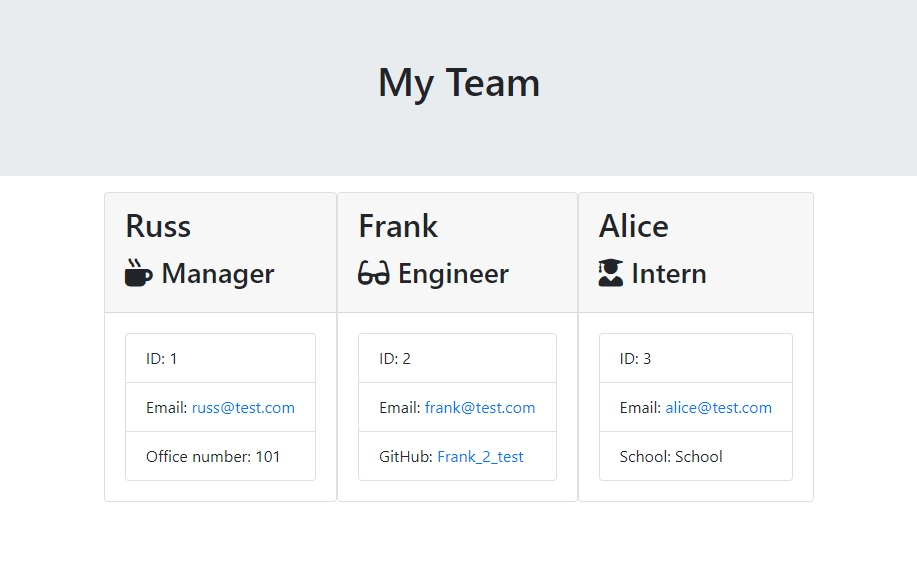

# Team Profile Generator

# Description
The purpose of this project was to create a team profile generator that will use classes & prompts via inquirer to take employee information and output that information to a webpage.

    Goals for this project:
        1. Create an employee class
        2. Create three other classes(manager, engineer and intern) that extends from the employee class
        3. Use inquirer to prompt the user questions about their team members
        4. Use the prompt answers to populate new employee cards to a webpage using the class constructor

# Table of Contents
* [Installation](#installation)
* [Usage](#usage)
* [Credits](#credits)
* [Questions](#questions)
* [License](#license)

# Installation
Copy and save the files from the repository.

# Usage

right click app.js and open terminal. Then type node app to run.

Prompts will appear asking for manager information.

After the manager prompts a question will ask the user what employee they would like to add to the team.

If the 'Engineer' is selected then the user will be prompted with information about the engineer.

Next, the user will be prompted again if they want to add another employee.

If the user selects 'Intern' more prompts will appear for the user to complete

When the user is done inputting employees they can select the 'No more employees' option

The html will now be populated with the inputs taken from the prompts. The html will be located in the output folder. Open the team.html to view the output.

# Credits
Created by: 
Andrew Boyle
[Git Hub Profile](https://github.com/Andyb2)

# Questions
If you have any questions about this project please email:
a.michael.boyle@gmail.com

# License

MIT License

    Copyright (c) [year] [fullname]

    Permission is hereby granted, free of charge, to any person obtaining a copy
    of this software and associated documentation files (the "Software"), to deal
    in the Software without restriction, including without limitation the rights
    to use, copy, modify, merge, publish, distribute, sublicense, and/or sell
    copies of the Software, and to permit persons to whom the Software is
    furnished to do so, subject to the following conditions:

    The above copyright notice and this permission notice shall be included in all
    copies or substantial portions of the Software.

    THE SOFTWARE IS PROVIDED "AS IS", WITHOUT WARRANTY OF ANY KIND, EXPRESS OR
    IMPLIED, INCLUDING BUT NOT LIMITED TO THE WARRANTIES OF MERCHANTABILITY,
    FITNESS FOR A PARTICULAR PURPOSE AND NONINFRINGEMENT. IN NO EVENT SHALL THE
    AUTHORS OR COPYRIGHT HOLDERS BE LIABLE FOR ANY CLAIM, DAMAGES OR OTHER
    LIABILITY, WHETHER IN AN ACTION OF CONTRACT, TORT OR OTHERWISE, ARISING FROM,
    OUT OF OR IN CONNECTION WITH THE SOFTWARE OR THE USE OR OTHER DEALINGS IN THE
    SOFTWARE.
  